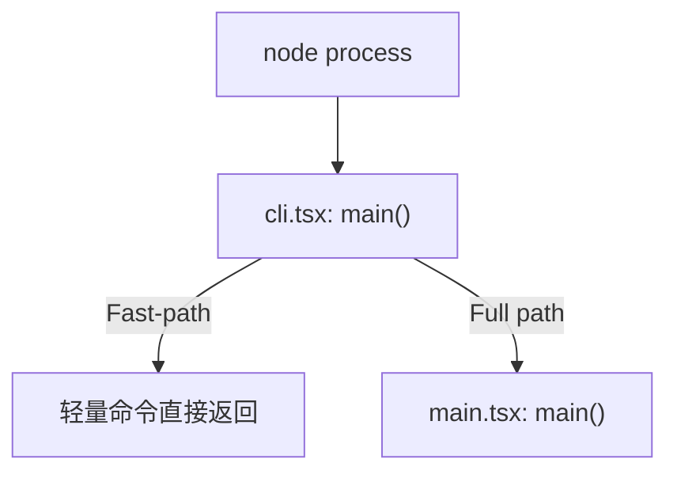

# Claude Code V2 架构卷 (01-04)

导航：[`首页`](../README.md) | [`总索引`](../master-index.md) | [`上一站：阅读路径`](../reading-paths.md) | [`下一站：实现卷`](../implementation/01-08.md)

本卷聚焦 Claude Code 从进程启动、环境装配到运行时内核与状态管理的骨架。

## 01 入口与引导

Claude Code 采用多层引导架构，用 fast-path 控制启动成本，再按需进入完整主程序。

### CLI 引导层 (`cli.tsx`)

- 图谱引用：[`02-cli-dispatch.svg`](../figures/02-cli-dispatch.svg)
- 源码镜像：[`../sources/claude-code/src/entrypoints/cli.tsx`](../../sources/claude-code/src/entrypoints/cli.tsx)
- 核心职责：`main()` 先分发 `--version`、`--dump-system-prompt`、`remote-control`、`daemon` 等轻量入口，再决定是否懒加载主程序。

### 主程序装配层 (`main.tsx`)

- 图谱引用：[`03-main-bootstrap.svg`](../figures/03-main-bootstrap.svg)
- 源码镜像：[`../sources/claude-code/src/main.tsx`](../../sources/claude-code/src/main.tsx)
- 核心职责：初始化 settings、policy、plugins、skills、telemetry、LSP、UI 与会话装配逻辑。

## 02 运行时内核

Claude Code 的主循环不是一个单文件，而是 `QueryEngine` 与 `query.ts` 的双层结构。

### 会话中枢 (`QueryEngine.ts`)

- 源码镜像：[`../sources/claude-code/src/QueryEngine.ts`](../../sources/claude-code/src/QueryEngine.ts)
- 关键状态：
  - `mutableMessages`：会话全量消息栈。
  - `totalUsage`：累计 token 使用量。
- 关键责任：`submitMessage()` 串起 system prompt 组装、输入预处理、transcript 写入与 query 驱动。

### Agent 循环 (`query.ts`)

- 图谱引用：[`04-query-kernel.svg`](../figures/04-query-kernel.svg)
- 源码镜像：[`../sources/claude-code/src/query.ts`](../../sources/claude-code/src/query.ts)
- 关键责任：管理 `while` 循环、模型调用、工具执行、恢复续轮、压缩与 stop hooks。

## 03 上下文与状态管理

### 工具使用上下文 (`ToolUseContext`)

- 图谱引用：[`06-tool-use-context.svg`](../figures/06-tool-use-context.svg)
- 源码镜像：[`../sources/claude-code/src/Tool.ts`](../../sources/claude-code/src/Tool.ts)
- 作用：把 tools、mcpClients、权限上下文、文件状态缓存、agent 身份等横切能力收敛到统一注入面。

### 全局 App 状态

UI 与会话层并非彼此独立。TUI、headless、subagent 与 background session 都依赖同一套状态与生命周期装配。

## 04 UI、REPL 与 Ink 承载层

- 关键文件：`REPL.tsx`、`print.ts`、`main.tsx`
- 核心分流：交互式场景进入 REPL，非交互式场景进入 headless 输出路径。
- 关键意义：Claude Code 的“产品表面”不等于“只有 TUI”，而是多个入口共享同一个运行时内核。

下一步建议：读 [`../implementation/01-08.md`](../implementation/01-08.md) 把输入、预处理、query loop、transcript 和任务链路补齐。
